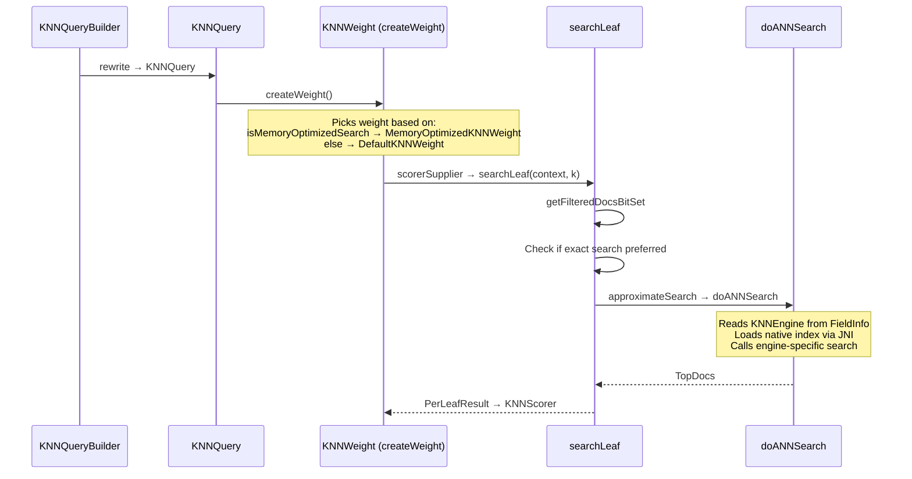
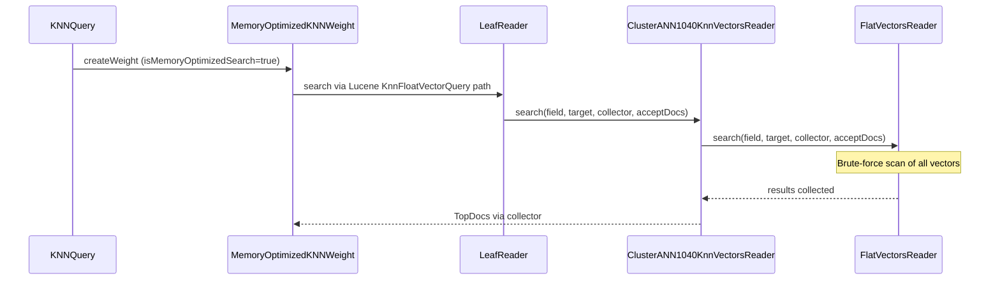
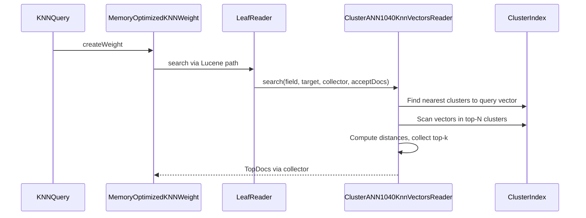

# ClusterANN Search Path — Low Level Design

## 1. Overview

This document covers the search path for the cluster-based ANN algorithm. Since the cluster index structure is not yet implemented, the initial search path will delegate to Lucene's flat vector search (brute-force). This provides a working end-to-end path that can be replaced with cluster-based search later.

## 2. Current Search Flow



### Key Dispatch Points

1. **`KNNQuery.createWeight()`** — picks `DefaultKNNWeight` or `MemoryOptimizedKNNWeight`
2. **`KNNWeight.searchLeaf()`** — decides exact vs approximate search
3. **`KNNWeight.approximateSearch()`** — reads engine from `FieldInfo`, dispatches to `doANNSearch()`
4. **`doANNSearch()`** — abstract method, each Weight subclass implements engine-specific search

### Problem for ClusterANN

`approximateSearch()` reads `KNN_ENGINE` from `FieldInfo` attributes. For cluster fields, there's no engine — the attribute is absent. The code does:

```java
final String engineName = fieldInfo.attributes().getOrDefault(KNN_ENGINE, KNNEngine.DEFAULT.getName());
knnEngine = KNNEngine.getEngine(engineName);
```

This would default to `FAISS` and then fail looking for native engine files.

## 3. Design Options

### Option A: Add ClusterANN branch in `approximateSearch()` (rejected)

Check for `knn_method=cluster` in `FieldInfo` attributes before the engine dispatch.

**Rejected:** Puts cluster-specific logic in the shared `KNNWeight` base class. Every new engine-less algorithm would add more branches.

### Option B: New ClusterANNWeight extending KNNWeight (rejected)

Create a new Weight subclass that overrides `doANNSearch()`.

**Rejected:** `KNNQuery.createWeight()` would need to know about cluster fields to pick the right Weight. The query doesn't have access to field info at weight creation time — it only has the field name.

### Option C: Override search in ClusterANN1040KnnVectorsReader (recommended)

The `ClusterANN1040KnnVectorsReader.search()` method is already called by Lucene's `KnnFloatVectorQuery` path. Since we're using `useLuceneBasedVectorField = true`, the `MemoryOptimizedKNNWeight` path calls `reader.search()` on the `KnnVectorsReader`, which is our `ClusterANN1040KnnVectorsReader`.

Currently it delegates to `flatVectorsReader.search()` (brute-force). Later, this is where the cluster search logic goes — no changes needed in `KNNQuery`, `KNNWeight`, or any shared code.

**Chosen because:**
1. Search logic lives in the reader — where the index data is
2. No changes to shared query/weight infrastructure
3. The reader already has access to the flat vectors for brute-force fallback
4. Future cluster search replaces the delegation in one place

## 4. Search Flow for ClusterANN

### Current (placeholder — brute-force via flat vectors)



### Future (cluster-based search)



The only change will be inside `ClusterANN1040KnnVectorsReader.search()`.

## 5. What Needs to Happen for Search to Work Now

For the brute-force placeholder to work end-to-end:

1. **`KNNQuery.createWeight()`** must route to `MemoryOptimizedKNNWeight` for cluster fields — this happens when `isMemoryOptimizedSearch=true` on the query
2. **`KNNQueryBuilder`** must set `isMemoryOptimizedSearch=true` for cluster fields
3. **`ClusterANN1040KnnVectorsReader.search()`** already delegates to `flatVectorsReader.search()` — this works

The key question: how does `isMemoryOptimizedSearch` get set? Let me trace that.

## 6. isMemoryOptimizedSearch Resolution

This flag is set in `KNNQueryBuilder` or `KNNQueryFactory` based on the field type. For cluster fields, we need to ensure this flag is set to `true` so the query goes through the Lucene reader path (`MemoryOptimizedKNNWeight`) rather than the native JNI path (`DefaultKNNWeight`).

If this flag is not set correctly, the query will go through `DefaultKNNWeight.doANNSearch()` which tries to load native engine files — and fails because there are none for cluster fields.

## 7. What This Does NOT Cover

- **Cluster index structure**: How clusters are stored and searched
- **Cluster-specific search parameters**: e.g., `nprobe` (number of clusters to search)
- **Exact search fallback**: When to fall back to brute-force for small segments
- **Filtering integration**: How filters are fused into cluster search
