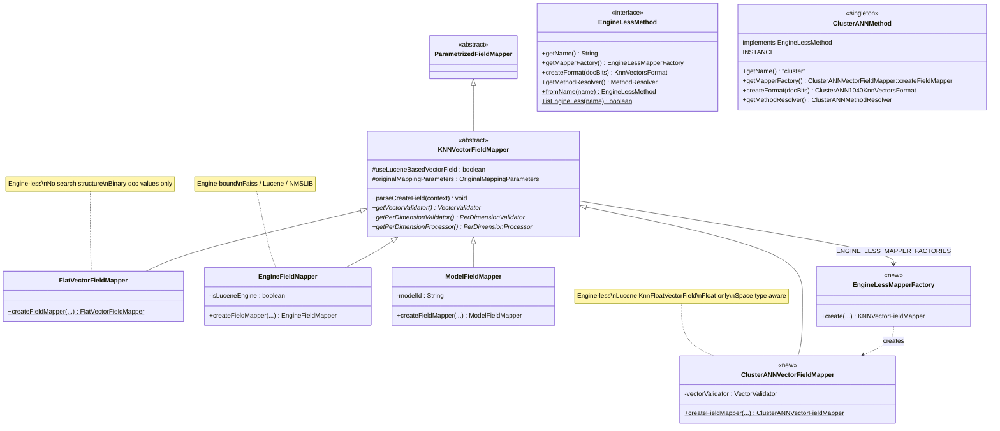
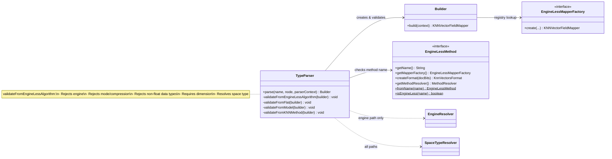
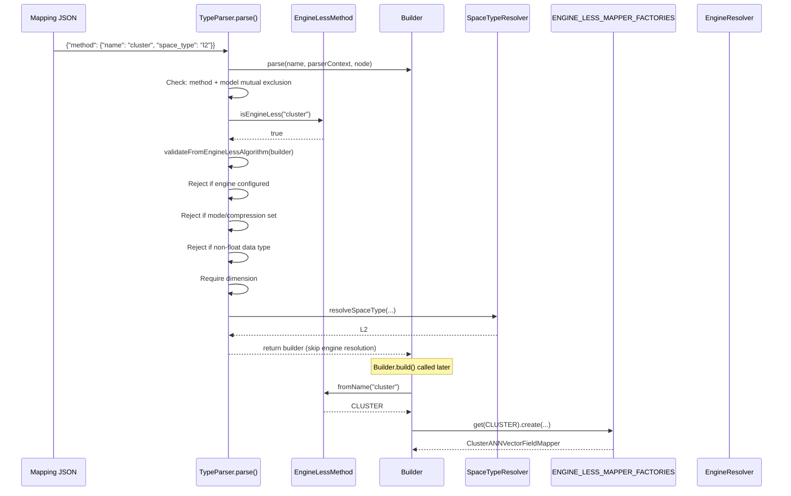
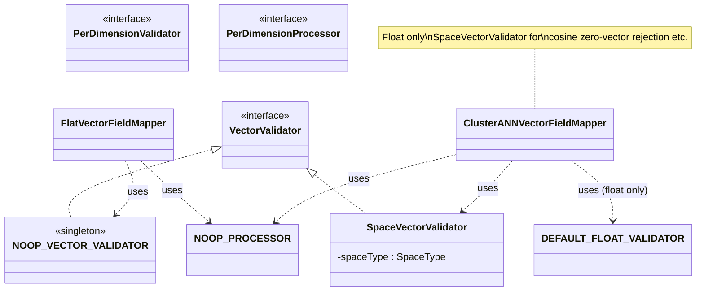
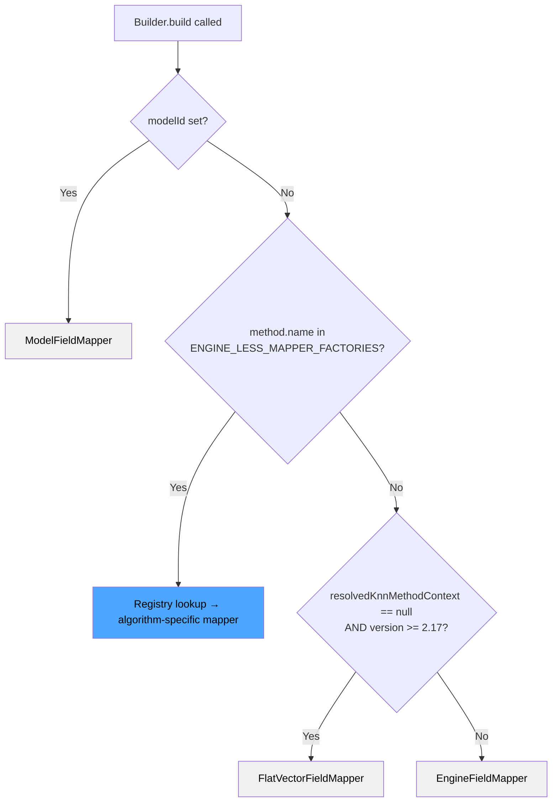

# ClusterANNVectorFieldMapper — Low Level Design

## 1. Overview

This document covers the mapper layer changes needed to integrate the cluster-based ANN algorithm. It does not cover codec or query path.

### Files to Modify

| File | Change |
|---|---|
| `KNNConstants.java` | Add `METHOD_CLUSTER` constant |
| `KNNVectorFieldMapper.java` (TypeParser) | Add engine-less algorithm detection and validation |
| `KNNVectorFieldMapper.java` (Builder) | Add registry-based routing for engine-less mappers |
| `KNNMethodContext.java` | Skip engine in toXContent/stream serialization when not configured |

### Files to Create

| File | Purpose |
|---|---|
| `EngineLessMethod.java` | Interface for engine-less algorithms — name, mapper factory, format factory, method resolver |
| `EngineLessMapperFactory.java` | Factory interface for creating engine-less mappers (folded into `EngineLessMethod`) |
| `ClusterANNMethod.java` | Implementation of `EngineLessMethod` for the cluster algorithm |
| `ClusterANNVectorFieldMapper.java` | New mapper for cluster algorithm |

## 2. Class Diagram — Mapper Hierarchy



### Legend

| Style | Meaning |
|---|---|
| `<<abstract>>` | Abstract class |
| `<<OpenSearch Core>>` | Class from OpenSearch core |
| `<<new>>` | New class/interface to be created |
| `<<enum>>` | Enum type |
| `$` suffix | Static method |
| `*` suffix | Abstract method |

## 3. Class Diagram — Validation & Parsing Flow



## 4. Sequence Diagram — Mapping Parse & Mapper Creation



## 5. Class Diagram — Validators & Processors



## 6. Builder.build() Routing — Engine-less Mapper Resolution

### Alternatives Considered

#### Alternative A: Hardcoded if-else per algorithm (rejected)

Each engine-less algorithm gets its own `if` block in `Builder.build()`.

**Rejected because:** Every new algorithm adds another branch. Violates open-closed principle.

#### Alternative B: Single shared EngineLessFieldMapper for all algorithms (rejected)

One mapper class for all engine-less algorithms. Differentiation in codec only.

**Rejected because:** If a future algorithm needs different ingestion behavior (different validators, data types, field attributes), this forces conditionals inside a single mapper.

#### Alternative C: EngineLessMethod interface with registry (chosen)

Each engine-less algorithm implements the `EngineLessMethod` interface, which provides the mapper factory, format factory, and method resolver. A static registry maps method names to implementations. `Builder.build()` does a single lookup.

**Chosen because:**
1. `Builder.build()` has one branch that never grows
2. Each algorithm owns its own mapper class
3. Factory signature is naturally shared
4. New algorithms: add enum value + register in map

### Routing Decision Tree



## 7. ClusterANNVectorFieldMapper — Key Design Decisions

### Vector Storage: Lucene KnnFloatVectorField

Uses `useLuceneBasedVectorField = true` with Lucene's native `KnnFloatVectorField`. Vectors are stored in Lucene's vector format. The codec layer will handle cluster index building separately.

### FieldType Attributes

The `FieldType` carries metadata for the codec to identify and configure cluster fields:

| Attribute | Value | Purpose |
|---|---|---|
| `knn_method` | `"cluster"` | Codec identifies this as a cluster algorithm field |
| `space_type` | e.g., `"l2"` | Codec/query uses for distance computation |
| `dimension` | e.g., `"128"` | Codec uses for vector layout |
| `data_type` | `"float"` | Always float — only supported type |

Plus Lucene's vector attributes (dimension, `FLOAT32` encoding, similarity function) set via `fieldType.setVectorAttributes()`.

### Data Type: Float Only

Only `VectorDataType.FLOAT` is supported. Byte and binary are rejected during validation in `validateFromEngineLessAlgorithm`. The mapper hardcodes `DEFAULT_FLOAT_VALIDATOR` and `VectorEncoding.FLOAT32`.

### Validation: SpaceVectorValidator

Uses `SpaceVectorValidator` (not NOOP) to validate vectors against the space type at ingestion time (e.g., cosine rejects zero-magnitude vectors).

## 8. XContent & Stream Serialization Changes

### Parsing (JSON → Java) — No Changes

`KNNMethodContext.parse()` handles the cluster mapping without modification.

### toXContent (Java → JSON) — Skip engine when not configured

Only write `engine` field when `isEngineConfigured == true`. Cluster mapping serializes without `engine` field.

### Stream Serialization — Version-gated at V_3_7_0

New format writes `isEngineConfigured` boolean before engine string. Old format preserved for BWC.

| Concern | Change | BWC Impact |
|---|---|---|
| Parsing (JSON → Java) | None | N/A |
| toXContent (Java → JSON) | Skip `engine` when `!isEngineConfigured` | None |
| Stream writeTo/readFrom | Version-gated boolean flag | Old nodes see old format |

## 9. Differences from FlatVectorFieldMapper

| Aspect | FlatVectorFieldMapper | ClusterANNVectorFieldMapper |
|---|---|---|
| Purpose | Store vectors only (no search structure) | Store vectors + cluster index via codec |
| Vector storage | Binary doc values (`DocValuesType.BINARY`) | Lucene `KnnFloatVectorField` |
| `useLuceneBasedVectorField` | `false` | `true` |
| Data types | Float, byte, binary | Float only |
| VectorValidator | NOOP | SpaceVectorValidator |
| FieldType attributes | None | `knn_method`, `space_type`, `dimension`, `data_type` |
| Space type awareness | No | Yes |

## 10. What This Does NOT Cover

- **Codec layer**: How the cluster index is built during segment flush/merge
- **Query layer**: How cluster-based search is executed
- **Algorithm parameters**: `method.parameters` (e.g., `num_clusters`, `sample_size`) — follow-up
- **Encoder support**: Future quantization via `encoder` in `method.parameters` — follow-up

## 11. Compression Support

### Mapping API

Cluster ANN accepts the `compression_level` top-level parameter with restricted values:

```json
{
  "my_vector": {
    "type": "knn_vector",
    "dimension": 128,
    "compression_level": "32x",
    "method": { "name": "cluster", "space_type": "l2" }
  }
}
```

### Validation in `validateFromEngineLessAlgorithm()`

The validation splits the original `mode/compression` rejection into two separate checks:

```java
// mode is always rejected — cluster ANN has no in_memory/on_disk distinction
if (builder.mode.isConfigured()) {
    throw MapperParsingException("mode cannot be used with algorithm 'cluster'");
}

// compression is accepted for 8x, 16x, 32x only
if (builder.compressionLevel.isConfigured()) {
    CompressionLevel level = CompressionLevel.fromName(builder.compressionLevel.get());
    if (level != x8 && level != x16 && level != x32) {
        throw MapperParsingException("Algorithm 'cluster' only supports 8x, 16x, and 32x compression");
    }
}
```

### Compression to docBits Mapping

| `compression_level` | `CompressionLevel` enum | `docBits` | Quantization |
|---|---|---|---|
| `"8x"` | `CompressionLevel.x8` | 4 | 4-bit scalar quantization |
| `"16x"` | `CompressionLevel.x16` | 2 | 2-bit scalar quantization |
| `"32x"` | `CompressionLevel.x32` | 1 | 1-bit scalar quantization |
| not configured | `NOT_CONFIGURED` | 1 (default) | 1-bit scalar quantization |

### Rejected Values

| `compression_level` | Reason |
|---|---|
| `"1x"` | No quantization path — cluster ANN always uses quantized ADC |
| `"2x"` | Not a supported quantization width |
| `"4x"` | Not a supported quantization width |

### Wiring (TODO)

The compression level is accepted at the mapping layer but not yet wired to the codec format. The remaining steps:

1. `validateFromEngineLessAlgorithm()` stores the resolved `docBits` on `KNNMethodConfigContext`
2. `EngineLessCodecFormatResolver.resolve()` reads `docBits` from resolved encoder in method params
3. `EngineLessMethod.createFormat(docBits)` passes it to the algorithm's format (e.g., `ClusterANN1040KnnVectorsFormat(docBits)`)
