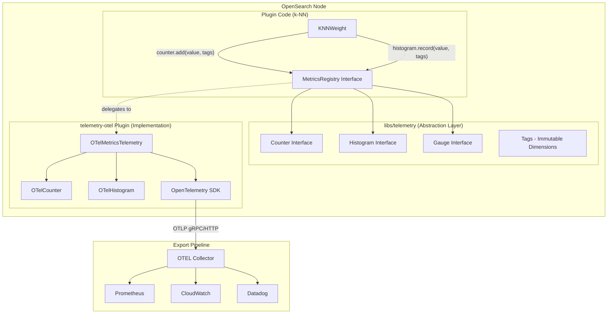
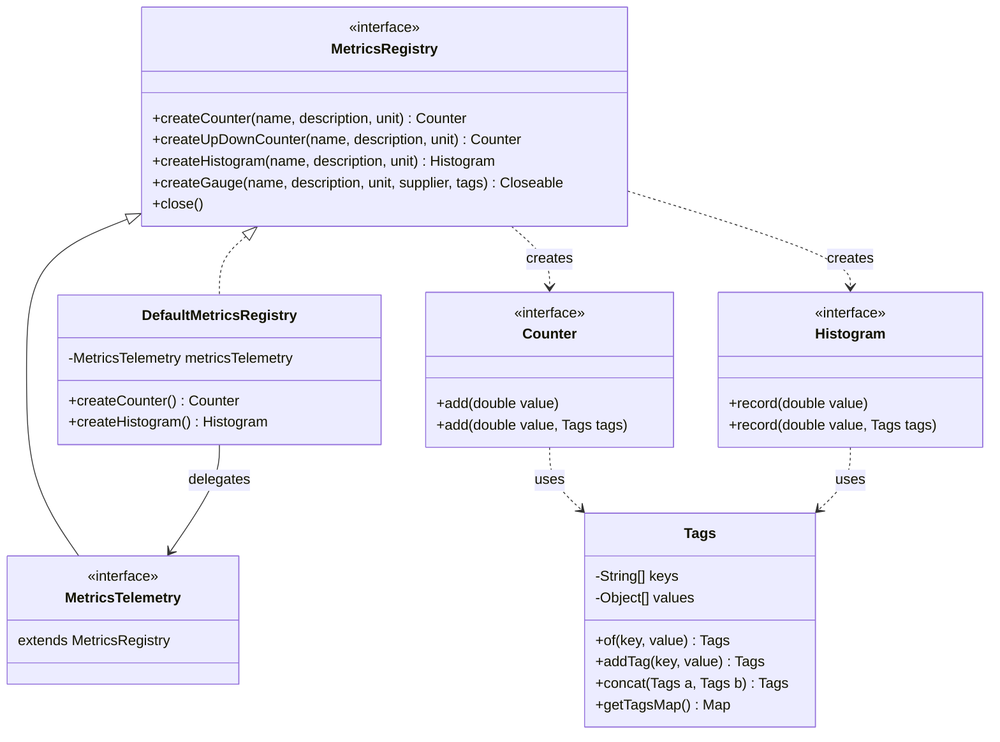
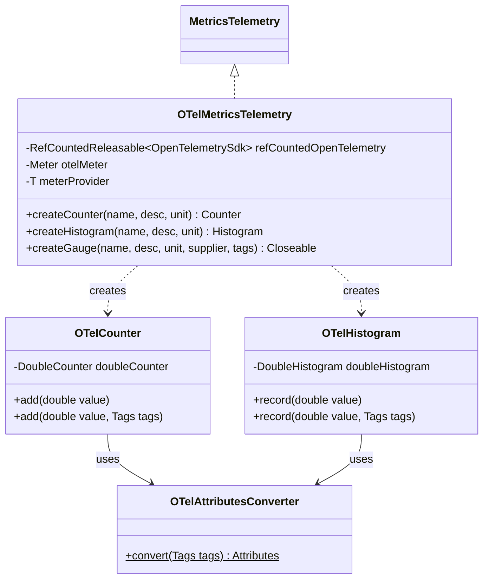
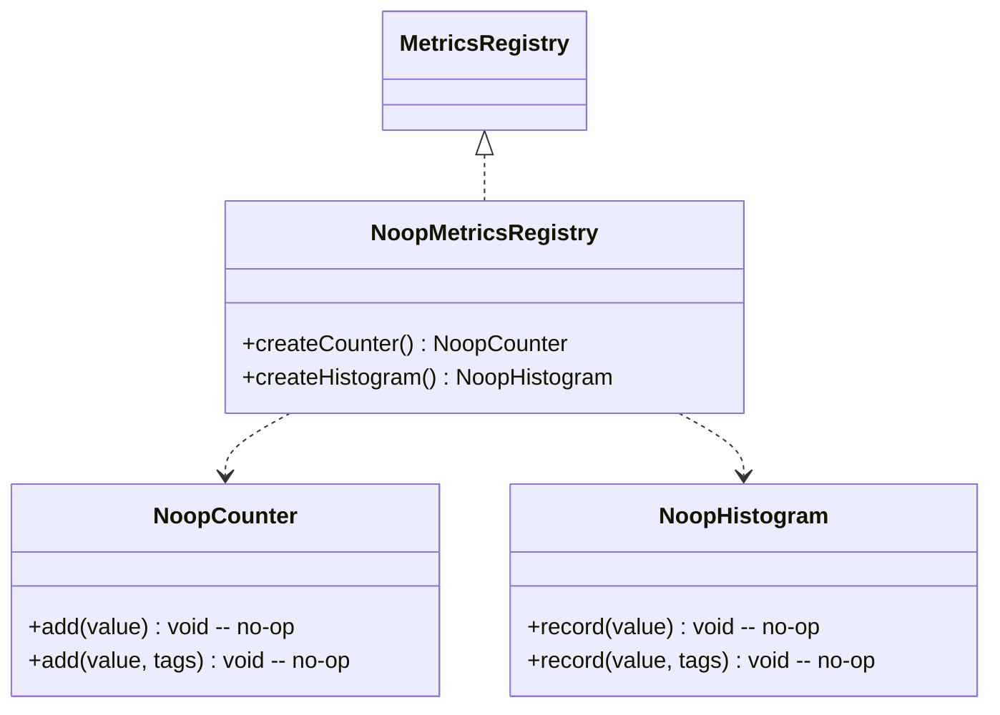
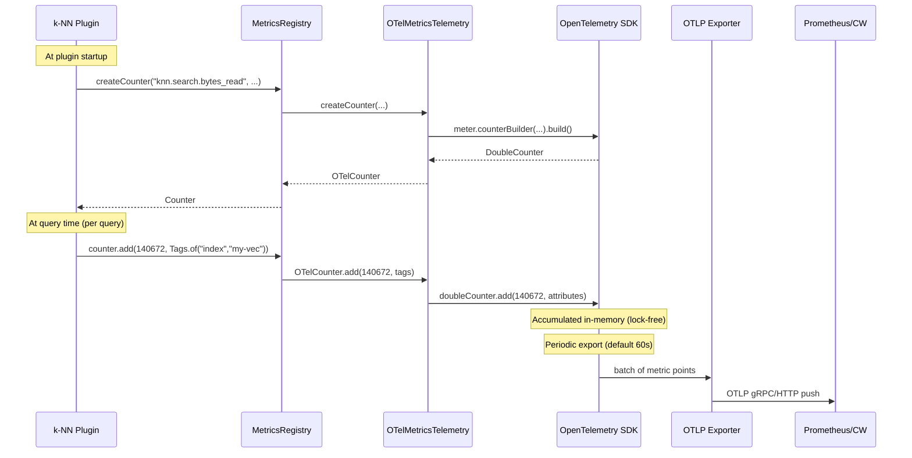
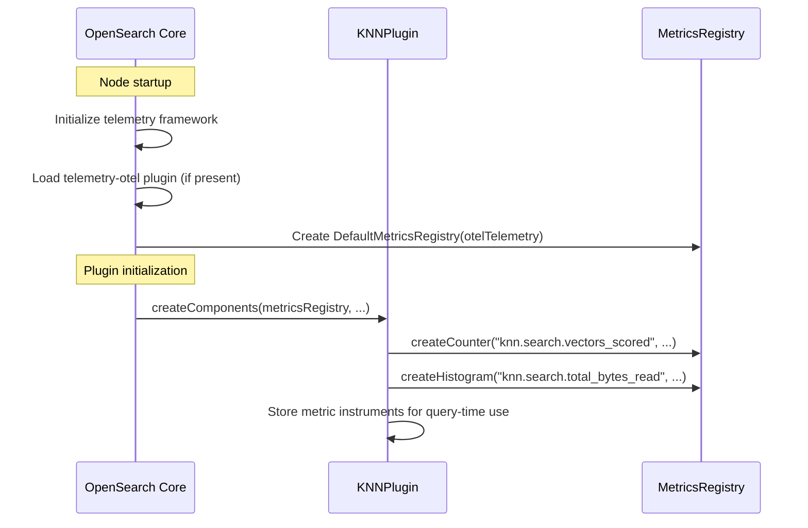
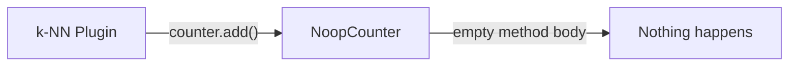

# OpenSearch Telemetry Framework — Deep Dive

## 1. High-Level Architecture

OpenSearch has a built-in telemetry framework (`libs/telemetry`) that provides an abstraction layer for metrics. The `telemetry-otel` plugin implements this abstraction using the OpenTelemetry Java SDK, enabling metrics export to any OTEL-compatible backend.



## 2. Component Breakdown

### 2.1 Abstraction Layer (`libs/telemetry`)

Lives in `libs/telemetry/src/main/java/org/opensearch/telemetry/metrics/`. This is what plugins code against.



### 2.2 OTEL Implementation (`plugins/telemetry-otel`)



### 2.3 No-Op Implementation (`noop/`)

When `telemetry-otel` plugin is NOT installed, OpenSearch uses no-op implementations. All metric operations become empty method calls — zero overhead.



## 3. Data Flow



## 4. Key Design Decisions

### 4.1 Metric Types and When to Use

| Type | Semantics | Use for |
|---|---|---|
| **Counter** | Monotonically increasing sum | Cumulative totals: total bytes read, total edges traversed |
| **Histogram** | Distribution of values | Per-query distributions: vectors scored per query, bytes per query |
| **Gauge** | Point-in-time snapshot | Current state: cache size, active searches |
| **UpDownCounter** | Sum that can decrease | In-flight counts: concurrent searches |

### 4.2 Tags (Dimensions)

`Tags` is immutable, sorted by key, supports String/long/double/boolean values. Used for slicing metrics in the backend.

```java
// Creation patterns
Tags.of("index", "my-vectors")                          // single tag
Tags.of("index", "my-vectors").addTag("shard", 0L)      // chained
Tags.ofStringPairs("index", "my-vectors", "algo", "hnsw") // bulk
Tags.concat(baseTags, queryTags)                         // merge
```

**Important:** High-cardinality tags (e.g., query ID, user ID) should be avoided — they explode metric series in the backend.

### 4.3 Thread Safety

- `Counter.add()` and `Histogram.record()` are thread-safe (OTEL SDK uses lock-free accumulators internally)
- `Tags` is immutable — safe to share across threads
- Metric instruments (Counter, Histogram) are created once at startup and reused

### 4.4 Export Configuration

The OTEL SDK is configured via `opensearch.yml`:

```yaml
telemetry.otel.metrics.exporter.class: io.opentelemetry.exporter.otlp.metrics.OtlpGrpcMetricExporter
telemetry.otel.metrics.exporter.endpoint: http://otel-collector:4317
telemetry.otel.metrics.export.interval: 60s
```

## 5. How k-NN Plugin Integrates

### 5.1 Getting MetricsRegistry



### 5.2 Recording at Query Time

```java
// In KNNWeight, after search completes:
KNNSearchMetrics metrics = queryMetrics.toSearchMetrics(...);

Tags tags = Tags.ofStringPairs(
    "index", knnQuery.getIndexName(),
    "algorithm", algorithm
).addTag("shard", (long) knnQuery.getShardId());

// Type A: Data Read
vectorBytesPrefetchedCounter.add(metrics.getVectorBytesPrefetched(), tags);
neighborBytesReadCounter.add(metrics.getNeighborBytesRead(), tags);

// Type B: Traversal (as histogram for distribution)
vectorsScoredHistogram.record(metrics.getVectorsScored(), tags);
edgesTraversedHistogram.record(metrics.getEdgesTraversed(), tags);
```

## 6. What Happens Without telemetry-otel Plugin



The abstraction guarantees zero overhead when telemetry is not configured. The k-NN plugin doesn't need to check if telemetry is enabled — it always calls `counter.add()` / `histogram.record()`, and the no-op implementation discards the call.

## 7. Summary for k-NN Search Metrics Integration

| Concern | How it's handled |
|---|---|
| Metric creation | Once at plugin startup via `MetricsRegistry.createCounter/Histogram` |
| Metric recording | Per-query via `counter.add(value, tags)` / `histogram.record(value, tags)` |
| Thread safety | Built into OTEL SDK (lock-free accumulators) |
| Export | Automatic via OTEL SDK periodic export (configurable interval) |
| Aggregation | Done by backend (Prometheus, CloudWatch) using tag dimensions |
| Zero overhead when disabled | No-op implementations in abstraction layer |
| Tag dimensions | `index`, `shard`, `algorithm`, `node_id` |
| No custom log files | Metrics go directly through OTEL SDK export pipeline |
